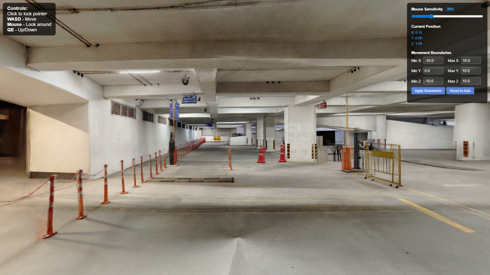

# 3D-Visualization-of-Gaussian-Splats

A lightweight, browser-based first-person navigation viewer for Gaussian Splat files (PES Parking lot). Explore 3D Gaussian Splat scenes with smooth camera controls and customizable boundaries.

## Features

- 🎮 **First-Person Controls** - WASD movement with mouse look
- 🎯 **Adjustable Mouse Sensitivity** - Real-time sensitivity control (5%-100%)
- 📍 **Live Position Tracking** - See your current X, Y, Z coordinates
- 🚧 **Movement Boundaries** - Configurable restrictions to keep navigation within scene bounds
- ⚡ **Smooth Movement** - Physics-based velocity and damping for a natural feel
- 🌐 **Zero Installation** - Runs entirely in the browser

## Demo



## Versions

This repository includes two versions:

### 1. **Adjustable Version** (`index-adjustable.html`)
- On-screen controls to modify movement boundaries
- Manual boundary input fields (Min/Max X, Y, Z)
- Apply and Reset buttons for boundary adjustments
- Best for: Testing, exploration, and finding optimal boundaries

### 2. **Hardcoded Version** (`index-hardcoded.html`)
- Pre-configured boundaries
- Cleaner UI with only sensitivity and position display
- Best for: Production deployment with known scene dimensions

## Quick Start

1. **Clone the repository**
   ```bash
   git clone https://github.com/yourusername/spz-viewer.git
   cd spz-viewer
   ```

2. **Add your SPZ file**
   - Place your `.spz` file in the root directory
   - Rename it to `a1.spz` or update the `url` in the HTML file:
     ```javascript
     const world = new SplatMesh({ url: "./your-file.spz" });
     ```

3. **Run a local server**
   ```bash
   # Using Python 3
   python -m http.server 8000
   
   # Using Node.js
   npx http-server
   ```

4. **Open in browser**
   - Navigate to `http://localhost:8000`
   - Click to lock pointer and start exploring!

## Controls

| Input | Action |
|-------|--------|
| **Click** | Lock/unlock pointer |
| **W** | Move forward |
| **S** | Move backward |
| **A** | Move left |
| **D** | Move right |
| **Q** | Move down |
| **E** | Move up |
| **Mouse** | Look around |
| **ESC** | Unlock pointer |

## Configuration

### Adjusting Movement Boundaries (Hardcoded Version)

Edit the `boundaries` object in the HTML file:

```javascript
let boundaries = { 
  minX: -0.8, 
  maxX: 1.5, 
  minY: 0.0, 
  maxY: 0.5, 
  minZ: -4, 
  maxZ: 2 
};
```

### Changing Movement Speed

Modify the `speed` variable:

```javascript
const speed = 2.5; // Units per second (default: 2.5)
```

### Adjusting Camera Starting Position

Set the initial camera position:

```javascript
camera.position.set(0, 0, 0); // X, Y, Z coordinates
camera.rotation.y = 0; // Facing direction (0 = -Z axis)
```

### Default Sensitivity

Change the default mouse sensitivity:

```javascript
let sensitivityFactor = 0.3; // Range: 0.05 to 1.0 (default: 0.3)
```

And update the slider value:

```html
<input type="range" id="sensitivity" min="5" max="100" value="30" step="5">
```

## Technical Details

### Dependencies

- **Three.js** (v0.178.0) - 3D rendering engine
- **PointerLockControls** - First-person camera controls
- **@sparkjsdev/spark** - SPZ/Gaussian Splat loader

All dependencies are loaded via CDN - no npm installation required.

### Browser Compatibility

- Chrome/Edge 90+
- Firefox 88+
- Safari 15+

Requires support for ES6 modules and Pointer Lock API.

## File Structure

```
spz-viewer/
├── index-adjustable.html    # Version with boundary controls
├── index-hardcoded.html     # Version with fixed boundaries
├── a1.spz                   # Your SPZ file (not included)
└── README.md                # This file
```

## Customization Tips

### Finding Optimal Boundaries

1. Use the **adjustable version** first
2. Navigate through your scene
3. Note the min/max X, Y, Z values from the position display
4. Set these values as boundaries
5. Test and refine
6. Transfer final values to the hardcoded version

### Scene Rotation

If your SPZ loads upside-down or rotated, adjust:

```javascript
world.rotation.z = Math.PI; // 180° around Z
world.rotation.y = Math.PI; // 180° around Y
world.rotation.x = Math.PI / 2; // 90° around X
```

## Known Issues

- Large SPZ files (>100MB) may take time to load
- No loading progress indicator (feature planned)
- Boundaries must be set manually (auto-detection in future release)

## Credits

- Built with [Three.js](https://threejs.org/)
- SPZ loading via [@sparkjsdev/spark](https://github.com/dylanebert/spark)

## Contributing

Contributions welcome! Please open an issue or submit a pull request.
